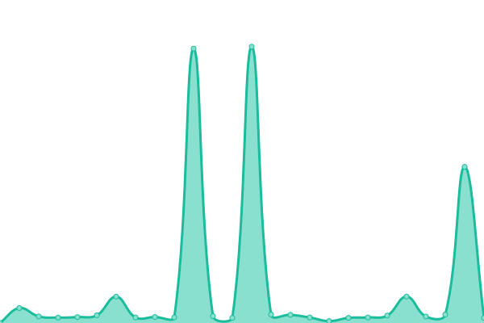
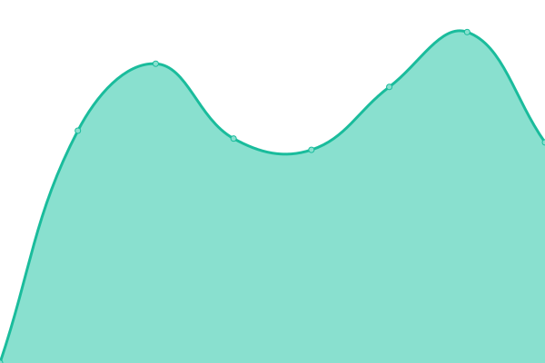
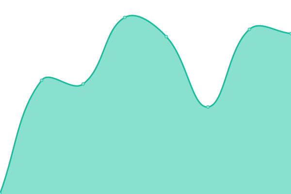

# [📈 Live Status](https://Daniel.github.io/uptime): <!--live status--> **🟧 Partial outage**

This repository contains the open-source uptime monitor and status page for [Daniel Eriksson](https://Daniel.github.io/uptime), powered by [Upptime](https://github.com/upptime/upptime).

With [Upptime](https://upptime.js.org), you can get your own unlimited and free uptime monitor and status page, powered entirely by a GitHub repository. We use [Issues](https://github.com/Daniel/uptime/issues) as incident reports, [Actions](https://github.com/Daniel/uptime/actions) as uptime monitors, and [Pages](https://Daniel.github.io/uptime) for the status page.

<!--start: status pages-->
<!-- This summary is generated by Upptime (https://github.com/upptime/upptime) -->
<!-- Do not edit this manually, your changes will be overwritten -->
<!-- prettier-ignore -->
| URL | Status | History | Response Time | Uptime |
| --- | ------ | ------- | ------------- | ------ |
|  [Bazi](https://bazi-api-8pr4.onrender.com/) | 🟩 Up | [bazi.yml](https://github.com/jun-wei/uptime/commits/HEAD/history/bazi.yml) | 

 3633ms
     
 | 

<a href="https://jun-wei.github.io/uptime/history/bazi">100.00%</a>
    

|  [Baby Naming](https://baby-chinese-naming-vvwag7rdrm4txuyt6lqekj.streamlit.app/) | 🟥 Down | [baby-naming.yml](https://github.com/jun-wei/uptime/commits/HEAD/history/baby-naming.yml) | 

 0ms
     
 | 

<a href="https://jun-wei.github.io/uptime/history/baby-naming">100.00%</a>
    

|  [Xiao Liu Ren](https://fengshuidahouse.lovable.app) | 🟩 Up | [xiao-liu-ren.yml](https://github.com/jun-wei/uptime/commits/HEAD/history/xiao-liu-ren.yml) | 

 1323ms
     
 | 

<a href="https://jun-wei.github.io/uptime/history/xiao-liu-ren">100.00%</a>
    

|  [AI Workflow](https://smart-workflow-aid.lovable.app) | 🟩 Up | [ai-workflow.yml](https://github.com/jun-wei/uptime/commits/HEAD/history/ai-workflow.yml) | 

 492ms
     
 | 

<a href="https://jun-wei.github.io/uptime/history/ai-workflow">100.00%</a>
    

|  [AI Skin](https://serich-ai.lovable.app) | 🟩 Up | [ai-skin.yml](https://github.com/jun-wei/uptime/commits/HEAD/history/ai-skin.yml) | 

 642ms
     
 | 

<a href="https://jun-wei.github.io/uptime/history/ai-skin">100.00%</a>
    

|  [Bazi](https://fengshui-da-house.lovable.app) | 🟩 Up | [bazi.yml](https://github.com/jun-wei/uptime/commits/HEAD/history/bazi.yml) | 

 3633ms
     
 | 

<a href="https://jun-wei.github.io/uptime/history/bazi">100.00%</a>
    

<!--end: status pages-->

[**Visit our status website →**](https://Daniel.github.io/uptime)

## 📄 License

- Powered by: [Upptime](https://github.com/upptime/upptime)
- Code: [MIT](./LICENSE) © [Anand Chowdhary](https://anandchowdhary.com), supported by [Pabio](https://pabio.com)
- Data in the `./history` directory: [Open Database License](https://opendatacommons.org/licenses/odbl/1-0/)
